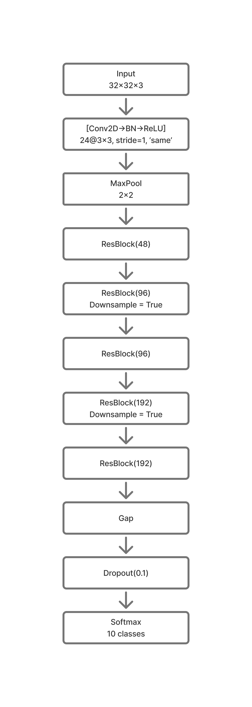
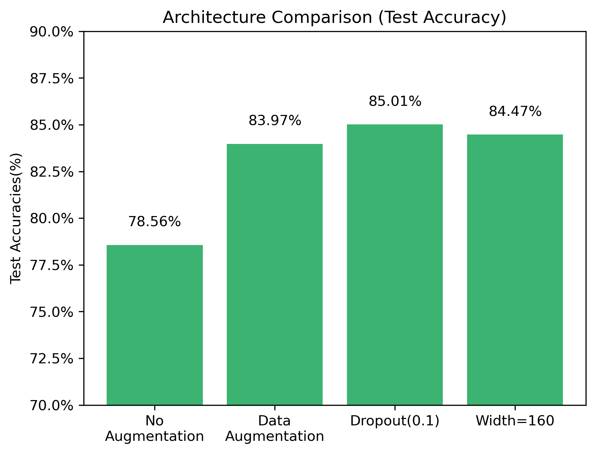
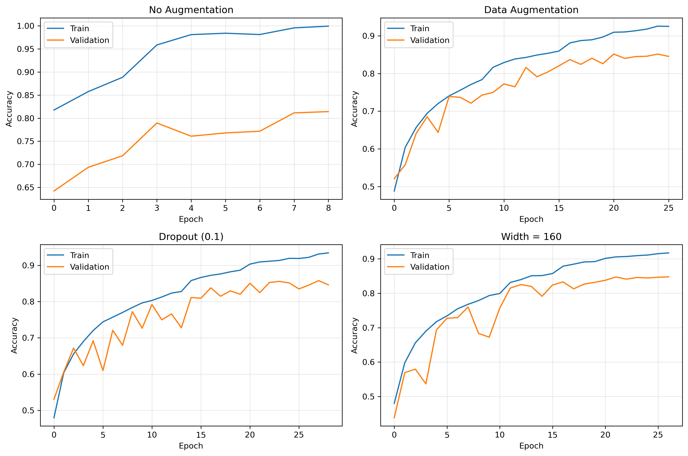
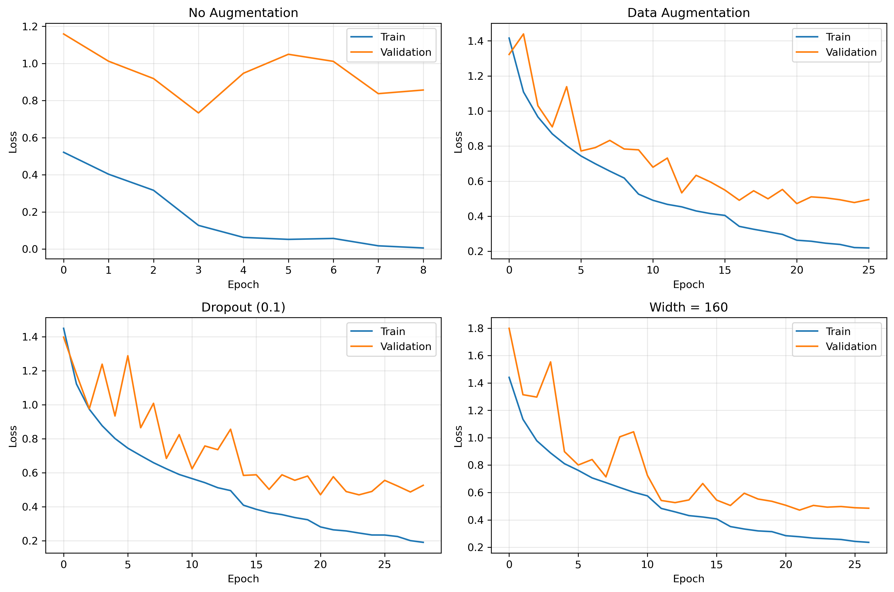
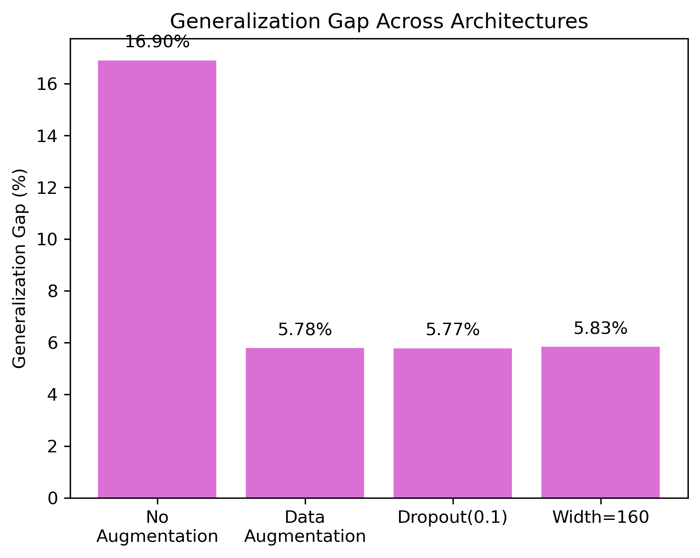

# CIFAR-10 ResNet From Scratch

A custom implementation of a Residual Network (ResNet) built from scratch in TensorFlow/Keras for image classification on the CIFAR-10 dataset.

The goal of this project was not to reproduce an existing ResNet architecture, but to understand how residual learning works by implementing residual blocks manually and evaluating different architectural and regularization choices.

---

## Features

- Custom Residual Block implementation
- Skip Connections
- Batch Normalization
- Data Augmentation
- Global Average Pooling
- Learning Rate Scheduling
- Early Stopping
- Model Checkpointing
- Modular project structure

---

## Dataset

- CIFAR-10
- 60,000 RGB images
- Image size: **32 × 32**
- 10 object classes

---

# Final Architecture

- Initial Conv layer (24 filters)
- 5 Residual Blocks
- Skip Connections
- Batch Normalization after every convolution
- Global Average Pooling
- Dense Softmax classifier

Architecture progression:

```
Input (32×32×3)

↓

Conv (24)

↓

ResBlock (48)

↓

ResBlock (96, Downsample)

↓

ResBlock (96)

↓

ResBlock (192, Downsample)

↓

ResBlock (192)

↓

Global Average Pooling

↓

Dropout (0.1)

↓

Dense (10)
```

<p align="center">

</p>

---

# Final Results

| Metric | Result |
|---------|--------|
| Train Accuracy | 91.3% |
| Validation Accuracy | 85.6% |
| Test Accuracy | **85.0%** |

---

# Experimental Results

| Experiment | Test Accuracy |
|------------|--------------:|
| No Data Augmentation | 78.56% |
| Data Augmentation | 83.97% |
| + Dropout (0.1) | **85.01%** |
| Reduced Width (160 filters) | 84.47% |

<p align="center">

</p>

---

# Learning Curves

## Training vs Validation Accuracy

<p align="center">

</p>

The learning curves show the impact of data augmentation and dropout on reducing overfitting.

---

## Training vs Validation Loss

<p align="center">

</p>

Validation loss demonstrates that data augmentation significantly improved generalization, while dropout provided a smaller additional improvement.

---

## Generalization Gap

<p align="center">

</p>

Generalization gap(Train_acc - Val_acc) across different architectures shows how well the model is generalizing to the data.

---

# Key Findings

This project investigated several architectural and regularization choices.

Major observations include:

- Data augmentation produced the largest improvement in model generalization.
- Dropout (0.1) slightly reduced overfitting and improved validation performance.
- Reducing the width of the final residual stage did not improve accuracy.
- Residual connections enabled training a substantially deeper network than the previous custom CNN project.
- Removing the initial MaxPooling layer greatly increased computation without being practical for this project.

A detailed record of every experiment is available in **experiments.md**.

---

# Repository Structure

```
resnet-cifar10/
│
├── images/
├── models/
├── notebooks/
├── src/
│   ├── dataset.py
│   ├── model.py
│   └── utils.py
│
├── README.md
├── experiment_log.md
└── requirements.txt
```

---

# Concepts Practiced

- Residual Learning
- Skip Connections
- Residual Blocks
- Batch Normalization
- Data Augmentation
- Global Average Pooling
- Learning Rate Scheduling
- Early Stopping
- Experimental Model Design
- CNN Architecture Analysis

---

# Future Work

Possible improvements include:

- Weight Decay (L2 Regularization)
- Label Smoothing
- MixUp / CutMix augmentation
- Cosine Learning Rate Scheduling
- Bottleneck Residual Blocks
- ResNet-18 style implementation